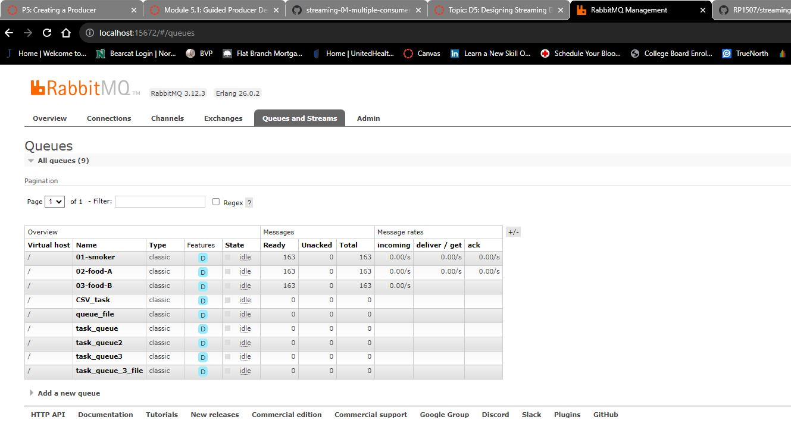

# streaming-05-smart-smoker

Ryan Smith - Module 5 Project Work - Smart Smoker Data

## Project Overview

For our project we will be creating a producer to send data that it receives from the smart smoker. The program will utilize three queues:
    Queue one will be for the smoker
    Queue two will be for Food A temp
    Queue three will be for Food B temp

The script will take the data from the .csv and make tuples for messages. It will use the date/time and the respective temperature. 
It will produce a message for each and send the message to the respective queue.
Data will be read from the file one row every 30 seconds.
We can see and monitor the messages that are being sent in the RabitMQ Management. You can see several screen shots of examples below. 

## Screenshots

The first image is the processor running in the VS Code environment.

The next several images will show the RabbitMQ admin web Management.

